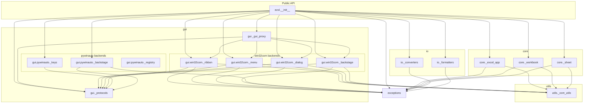

# Architecture

This page describes the module layout of `ezxl`, the dependency flow between layers, and the design decisions that shaped them.

---

## Module layout

```text
src/ezxl/
├── __init__.py          # Public API exports, Python version guard
├── version.py           # Single source of truth for __version__
├── exceptions.py        # EzXlError hierarchy (all public exceptions)
├── core/
│   ├── __init__.py
│   ├── _excel_app.py    # ExcelApp — COM session lifecycle
│   ├── _workbook.py     # WorkbookProxy — workbook operations
│   └── _sheet.py        # SheetProxy, CellProxy, RangeProxy
├── gui/
│   ├── __init__.py
│   ├── _protocols.py    # ABCs: six GUI backend contracts (ports)
│   ├── _gui_proxy.py    # GUIProxy — unified GUI facade + _COMKeysBackend (internal)
│   ├── win32com/
│   │   ├── __init__.py
│   │   ├── _ribbon.py   # RibbonProxy (COM adapter)
│   │   ├── _menu.py     # MenuProxy (COM adapter)
│   │   ├── _dialog.py   # DialogProxy (COM adapter)
│   │   └── _backstage.py  # COMBackstageBackend (COM adapter)
│   └── pywinauto/
│       ├── __init__.py
│       ├── _backstage.py  # PywinautoBackstageBackend (UIA adapter)
│       ├── _keys.py       # PywinautoKeysBackend (UIA adapter)
│       ├── _connect.py    # Window handle resolution helper
│       └── _registry.py  # UI element registry (internal)
├── io/
│   ├── __init__.py
│   ├── _converters.py   # read_excel, read_csv, xlsx_to_csv, csv_to_xlsx, read_sheet
│   └── _formatters.py   # ExcelFormatter (openpyxl-based)
└── utils/
    ├── __init__.py
    └── _com_utils.py    # wrap_com_error, wait_until_ready, assert_main_thread
```

Modules prefixed with `_` are internal. The public API surface is declared entirely in `__init__.py` via `__all__`.

---

## Layer dependency diagram



---

## Key design decisions

### Exceptions first

`exceptions.py` is the first module in the dependency graph. Every other module imports from it. This means the error contract is defined before any COM call is written, and callers can catch `EzXlError` (or a specific subclass) without importing any COM infrastructure.

### COM error boundary

`pywintypes.com_error` is a `pywin32` internal type. No raw COM error ever propagates past the `ezxl` package boundary. The `wrap_com_error` decorator in `utils/_com_utils.py` intercepts all `pywintypes.com_error` exceptions at the call site and re-raises them as either `ExcelSessionLostError` (for disconnection HRESULTs) or `COMOperationError` (for all other COM failures).

### Thread identity enforcement

Excel COM uses the Single-Threaded Apartment (STA) model: every COM call must originate from the thread that created the COM object. `ExcelApp` records its creating thread identifier at construction time. `assert_main_thread()` (in `utils/_com_utils.py`) is called at the entry point of every public method and raises `ExcelThreadViolationError` before the COM dispatcher is reached. This gives callers a clear, actionable error message instead of a cryptic RPC fault.

### Proxy hierarchy

The COM object model is surfaced through a three-level proxy hierarchy:

```text
ExcelApp  →  WorkbookProxy  →  SheetProxy  →  CellProxy / RangeProxy
```

Each level holds a reference to its parent (not to the raw COM object). When a COM object is needed, the proxy resolves it lazily through the chain. This means proxies remain valid across save-and-reopen cycles as long as the name has not changed, and raw COM objects are never leaked to callers.

### GUI layer: Ports and Adapters

The `gui` package implements a Ports and Adapters pattern scoped to the GUI interaction surface. The six ABC classes in `_protocols.py` are the ports:

- `AbstractRibbonBackend`
- `AbstractMenuBackend`
- `AbstractDialogBackend`
- `AbstractKeysBackend`
- `AbstractBackstageFileOps` — Backstage file operations via COM (focus-independent, locale-independent)
- `AbstractBackstageNavigator` — Backstage UIA navigation (for `open_options`, `open_save_as_panel`, and other panel traversals)

The COM backends in `gui/win32com/` and the pywinauto backends in `gui/pywinauto/` are the adapters. `GUIProxy` is the facade: it accepts any conforming implementation for each surface at construction time, defaulting to the COM adapter when none is provided.

The COM and pywinauto Backstage backends are not interchangeable alternatives — they are complements that cover different capabilities. `COMBackstageBackend` implements `AbstractBackstageFileOps` and handles file operations (`save`, `save_as`, `open_file`, `close_workbook`) entirely through the Excel COM object model: no window focus required, no locale sensitivity. `PywinautoBackstageBackend` implements `AbstractBackstageNavigator` and handles panel navigation that has no COM equivalent (`open_options`, `open_save_as_panel`), driving the Backstage UI via UI Automation with an Alt-sequence fallback.

`GUIProxy` surfaces both through separate attributes: `gui.backstage` always holds a `COMBackstageBackend` (or any `AbstractBackstageFileOps` injected at construction time); `gui.backstage_nav` holds an `AbstractBackstageNavigator` instance, or `None` when no UIA navigator has been injected. Callers that only perform file operations never need to supply a pywinauto dependency.

This design was adopted only for the GUI layer because it is the only layer where backend swappability and composition deliver real value — some deployment environments block COM GUI calls but permit pywinauto UI Automation, or require a mix of the two. The `core` and `io` layers have no equivalent swappability need and do not use this pattern.

!!! note "Project-level hexagonal architecture was evaluated and rejected"
Full hexagonal architecture at the project level would require renaming `core/` to `domain/`, introducing application-level port interfaces, and routing all entry points through those ports. For a library whose primary abstraction IS the infrastructure (COM dispatch, Win32 handles), this adds indirection with no protective benefit. The GUI-level Ports and Adapters pattern is the right scope. See `.github/instructions/README.md` for the full decision record.

### I/O layer: no Excel required

`io/_converters.py` and `io/_formatters.py` have no dependency on `pywin32`. They operate on closed files using polars (backed by `fastexcel`, a Rust engine) for data I/O and `openpyxl` for formatting. This means format conversion and closed-file styling work even on machines without Excel installed, as long as `polars` and `openpyxl` are available.

### Auto-generated dependency graph

The import dependency graph can be regenerated from the live source tree using [grimp](https://github.com/seddonym/grimp):

```bash
PYTHONPATH=src python .scripts/dev/generate_architecture_graph.py
```

The static Mermaid diagram above is maintained manually and reflects the intended dependency flow at the time of writing. The grimp-generated graph reflects the actual runtime import structure and will flag any unintended circular imports or layer violations.
