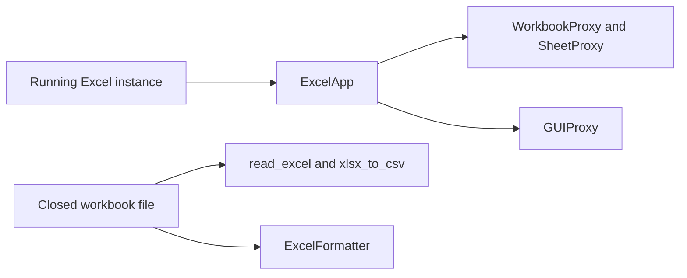

# Concepts

This section explains why EzXl is split between live Excel automation, GUI backends, and closed-file processing.

!!! abstract "📚 What this section covers"
    These pages focus on design rationale and trade-offs. For task-oriented instructions, use the guides and tutorial sections.

## 📦 Two execution surfaces

EzXl deliberately separates live Excel automation from closed-file processing. The COM layer exists for scenarios that need a running Excel process, while the I/O and formatting layer exists for scenarios that only need workbook files.

This split keeps file conversion and formatting usable even on machines where Excel is unavailable or undesirable in automation pipelines.

## 📦 Why the GUI layer is pluggable

The GUI layer exposes contracts for ribbon, menu, dialog, keys, and Backstage navigation because these surfaces can require different automation strategies. COM works well for direct Excel object model interactions, while UI Automation can still be useful for visual Backstage navigation and targeted keystroke flows.

The package therefore keeps the pluggability local to the GUI surface instead of forcing a repository-wide ports-and-adapters architecture where it would add indirection without improving the live Excel workflows.

## 📦 Why closed-file I/O stays separate

The closed-file functions use `polars`, `fastexcel`, `xlsxwriter`, and `openpyxl` rather than COM. That design reduces operational friction for batch conversions, test runs, and documentation examples because these flows do not require Excel to be installed or running.

It also keeps the public API honest about capability boundaries: if you need workbook UI state, use the COM layer; if you need fast data movement on files, use the I/O layer.

## ➡️ Related pages

- [Architecture](../architecture.md)
- [API reference](../api/index.md)
- [Examples](../examples/index.md)
